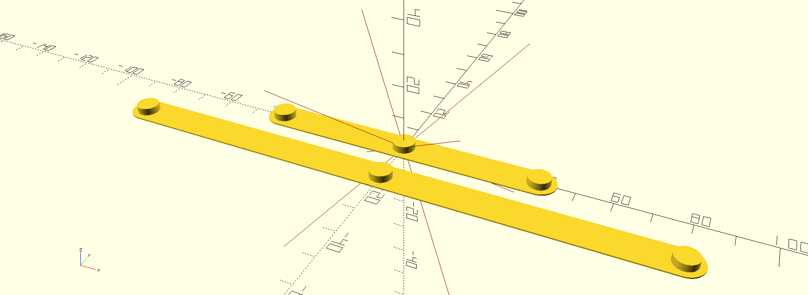

# Fridge magnets

  * Magnet size: 5 mm * 1.6 mm
  * Nozzle size: 0.4 mm
  * Layer height: 0.2 mm
  * Wall loops: 1
  * Top shell layers: 2
  * Top shell thickness: 0 mm
  * Bottom shell layers: 1
  * Sparse infill density: 0 %

  Add a pause to the third-last layer.
